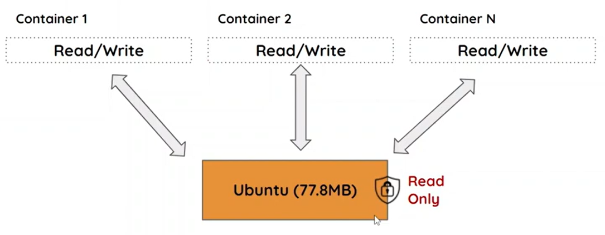

# Imagens: Como se comportam? 

Quando colocamos o comando para ver as imagens:
- docker images

Como resultado, conseguimos ver as imagens e os seus tamanhos. 
**Então quando temos uma imagem, por exemplo, Ubuntu de 70MB, e vários containers, cada container vai ocupar 70MB?**

R: Não, o Docker é inteligente o suficiente para reaproveitar a mesma imagem que é utilizada em diferentes containers. 

O Container é composto pela imagem e uma abstração de Read/Write, tudo é escrito na camada de abstração, de maneira que a imagem não é modificada.

Além disso, ele faz aproveitamento de camadas em comum, por exemplo, se for instalado outra imagem que contém camadas comuns, o Docker não instala as mesmas camadas duas vezes. 

### Comandos:

**Buscando os IDs de todas as imagens**

- docker images -q

**Removendo todas as imagens**

- docker rmi $(docker images -q)

OBS: esse $() é para rodar um comando dentro do outro (SUBSHELL), 

**ATENÇÃO:** Só podemos excluir imagens se não há containers parados ou em execução. 